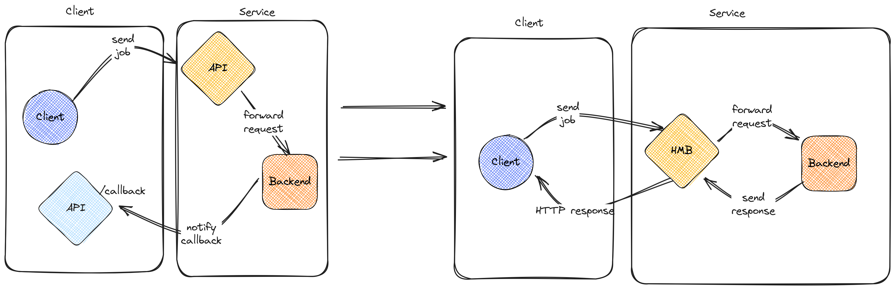

# HMB proxy

<p align="center">
  <br>
  <b>Hold My Beer proxy</b>
</p>

------

Abstract asynchronous processing and make it synchronous for your clients.

[](https://github.com/meero-com/hmb-proxy/actions/workflows/ci.yml)

## Goal

The HMB proxy is made to allow under-the-hood, loosely coupled processing with parallel processing in mind.

Instead of having a "fire & forget", callback-supported asynchronous processing, customers can rely on simple HTTP calls
while having all the benefits of async processing.

Using a **timeout** / **retry** / **exponential back-off** strategy, users can completely abstract the implementation
complexity of asynchronous systems.

<p align="center">
  <br>
</p>

## Build

This project supports packaging through container images.

The proxy can be built using the following command:

```console
$ docker build -t hmb-proxy:local .
```

It can then be run locally using:
```console
$ docker run -it --rm hmb-proxy:local
```

## Development

The repository offers different utilities to improve development.

### Compose setup

A `docker-compose.yml` manifest is available in the top-level directory to emulate AWS services using localstack.

## Glossary

- Project name: HMB proxy
- Reference to the executable: hmb-proxy
