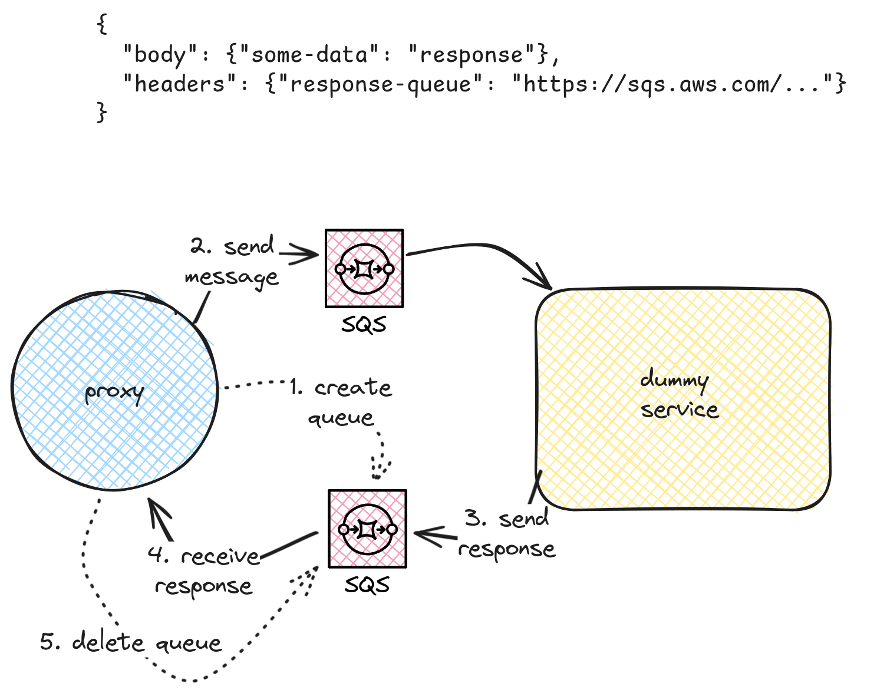

# Dummy test service



## Build

```console
$ go build
$ ./dummy-service
```

## Test the service

Start top-level localstack container:
```console
$ pushd ..
$ docker compose up -d localstack
$ popd
```

Send an SQS Message
```console
$ bash sqs-send.sh
```
